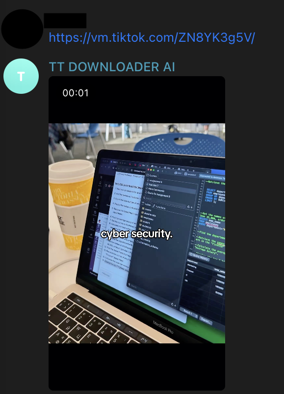

# TikTok Downloader Telegram Bot

An asynchronous, production-ready Telegram bot designed to fetch and stream watermark-free media from TikTok links with user rate-limiting and persistent logging.

## Features

- **Asynchronous Media Pipeline**: High-throughput processing powered by `aiogram 3.x` and non-blocking HTTP requests via `aiohttp`.
- **Persistent Storage & Schema Migrations**: PostgreSQL integration with strict schema definitions, automated table initialization, and fast connection pooling using `asyncpg`.
- **User Limits & Usage Tracking**: Tracks daily user request limits and logs download metadata (`BIGSERIAL`, `BIGINT` user identifiers, timestamps with time zone).
- **Containerized Deployment**: Minimal runtime footprint using multi-stage/slim Docker patterns (`python:3.12-slim`).
- **Strict Static Typing**: Fully typed Python codebase passing `basedpyright`/`pyright` with strict configuration.

## Tech Stack

- **Language**: Python 3.12
- **Telegram Bot Framework**: [aiogram 3.x](https://github.com/aiogram/aiogram)
- **Database**: PostgreSQL
- **Database Driver**: [asyncpg](https://github.com/MagicStack/asyncpg)
- **HTTP Client**: [aiohttp](https://github.com/aio-libs/aiohttp)
- **Containerization**: Docker

## Architecture & Directory Structure

```text
.
├── database.py       # asyncpg connection pool initialization and migration runner
├── schema.sql        # DDL definitions (users, download_logs)
├── downloader.py     # Asynchronous API fetcher and parser
├── handlers.py       # Telegram update routers and command handlers
├── main.py           # Application entrypoint and lifecycle events
├── Dockerfile        # Production-grade slim container build recipe
├── .dockerignore     # Build context exclusions
├── .env.example      # Environment variables template
└── requirements.txt  # Production dependencies
```

## Getting Started

### Prerequisites

- Python 3.12+
- PostgreSQL instance running locally or via container
- Telegram Bot Token (obtained from [@BotFather](https://t.me/BotFather))

### Local Setup

1. **Clone the repository:**
   ```bash
   git clone [https://github.com/egorrikhter/tiktok-downloader-bot.git](https://github.com/egorrikhter/tiktok-downloader-bot.git)
   cd tiktok-downloader-bot
   ```

2. **Create and activate a virtual environment:**
   ```bash
   python3 -m venv .venv
   source .venv/bin/activate
   ```

3. **Install dependencies:**
   ```bash
   pip install --upgrade pip
   pip install -r requirements.txt
   ```

4. **Configure environment variables:**
   Copy the example configuration file and fill in your actual credentials:
   ```bash
   cp .env.example .env
   ```

   Update `.env` with your values:
   ```env
   BOT_TOKEN=your_bot_token_here
   API_KEY=your_api_key_here
   DB_USER=postgres
   DB_PASSWORD=your_password_here
   DB_NAME=tiktok_bot
   DB_HOST=localhost
   DB_PORT=5432
   ```

5. **Run the bot:**
   ```bash
   python main.py
   ```

## Docker Deployment

To build and run the bot in an isolated container environment:

1. **Build the image:**
   ```bash
   docker build -t tiktok-bot .
   ```

2. **Run the container:**
   ```bash
   docker run --rm -d \
     --name tiktok-bot-instance \
     --env-file .env \
     tiktok-bot
   ```

3. **Inspect container logs:**
   ```bash
   docker logs -f tiktok-bot-instance
   ```

## Demo



## License

MIT
